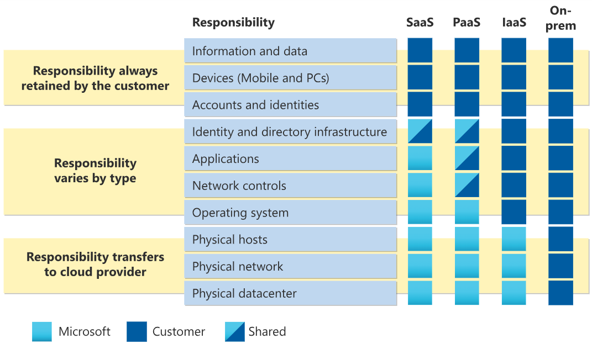
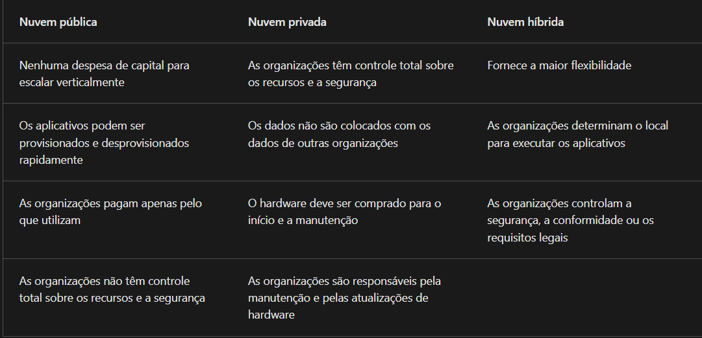

# Resumo do Lab  
# Resumo da atividade do curso de preparo para prova AZ-900 Certification

## Nuvem Pública  
- Vem de provedoras como AWS e Azure  
- Facilidade de expansão, serviços com fácil acesso, custo por uso  

## Nuvem Privada  
- É localizada fisicamente dentro da empresa  
- A empresa tem controle total de dados, recursos e segurança  

## Nuvem Híbrida  
- É localizada tanto localmente quanto por provedoras  
- Maior flexibilidade e gerenciamento de dados, custo e equipamentos  

# CapEx e OpEx (Despesas Operacionais)  

## CapEx (despesas de capital): Gasto em infraestrutura  
- A CapEx normalmente é uma despesa inicial única para comprar ou proteger recursos tangíveis. Um prédio novo, a repavimentação do estacionamento, a construção de um datacenter ou a compra de um veículo da empresa são exemplos de CapEx.
- As despesas reduzem com o decorrer do tempo (basicamente tem um custo alto para instalação, mas a manutenção é mais barata)  

## OpEx (despesas operacionais): Gasto sob demanda  
- A OpEx é o gasto de capital em serviços ou produtos ao longo do tempo. O aluguel de um centro de convenções, o leasing de um veículo da empresa ou a assinatura de serviços de nuvem são exemplos de OpEx. A computação em nuvem se enquadra na OpEx porque opera em um modelo baseado em consumo.
- As despesas são constantes, onde tudo que for usado será cobrado  

# Beneficios da nuvem:
### 	Sob demanda, ou seja pague somente o que usar.
### 	Alta disponibilidade.
### 	Escalabilidade e elasticidade

## (S.L.A.):
### 	Em caso de falha, gera-se credito para compensar a falha.
### 	Indisponiblidade de serviço
### 	Varios niveis onde é fornecido vairos niveis onde retrata o tempo medio que um serviço pode ficar fora do ar.
### 	Irá se fornecido informações sobre status geral (em caso de ser um problema que afete uma grande area: regional, geral outros), e meios de contornar o problema se possivel.

## Escalabilidade:
### 	Ajustar a capaciade do ambiente para atender demanda.	
### 	Dividido em escalamento vertical e horizontal.
	
## Elasticidade:
### 	Pode dimencionar o ambiente a partir da demanda (quantidade de acessos), aumentando e diminuindo de acordo com o fluxo de acessos.

## Confiabilidade:
### 	Divisão regional, proporciona maior segurança em casos catastroficos, one é possivel ter serviços em multiplas regioes onde em caso de falha regional, serviços em outras regioes não são afetados.
### 	Previsibilidade.

## Segurança
### 	Oferece multiplas ferramentas para auxiliar no mantimento da segurança de serviços.
### 	Implantação parte do usuario (cliente, TI, empresa, ...), a microsoft só fornece as ferramentas.

## Governaça
###	 Politicas e regras para gerirservisços e a rede.
	
## Gerenciabilidade
### 	Facilidade de uso.
### 	Pocibilidade de uso de codigos de automatização

# Modelos de Serviço em Nuvem  

## IaaS (Infraestrutura como Serviço)  
Ambiente onde é gerido o bruto, como personalização do servidor, firewalls e manutenção.  
- Serviço de nuvem mais flexível (é possível configurar e gerenciar o hardware necessário).  

## PaaS (Plataforma como Serviço)  
Ambiente onde apenas os serviços (ex: banco de dados, sistema operacional) são gerenciados, sem foco na infraestrutura.  
- Focado no gerenciamento de aplicativos (a gestão da plataforma é responsabilidade do provedor de nuvem).  

## SaaS (Software como Serviço)  
Ambiente onde os aplicativos e softwares hospedados (Office, Teams, entre outros) são gerenciados, incluindo suas licenças.  
- Modelo de pagamento sob demanda (os usuários pagam pelo software utilizado em um modelo de assinatura).  

# Modelo de Responsabilidade Compartilhada  

## Responsabilidades  

- **Local:** Responsável por tudo.  
- **IaaS:** Hosts físicos, rede física e datacenter físico são responsabilidades do fornecedor.  
- **PaaS:** Mantém as responsabilidades do IaaS, adicionando a gestão do sistema operacional ao provedor e compartilhando a gestão de aplicativos, controle de rede e infraestrutura de identidade e diretório.  
- **SaaS:** Mantém as responsabilidades do IaaS e do PaaS, sendo que apenas a infraestrutura de identidade e diretório é compartilhada.  

# Regiões 
-São compostas de um ou mais datacenters próximos (ideal será 3 para redundância).
-Fornecem flexibilidade e escala para reduzir o delay.
-Preço não tabelado cada região terá um custo por serviço que pode variar.
-Existem recurso limitados por região devido quantidade usabilidade 

## Pares e regiões
-São zonas onde em caso de desatre recovery que venham afetar toda uma região, alguns serviços são migrados para outra região para evitar deixar o serviço fora do AR.

## Regeões Soberanas
-São regiões não disponiveis para o usuario comun, sendo utilizado principalmente para uso militar e governamental.
-Acessivel somente para pessoal autorizado.
-OBS 21 Vianet é a empresa que gerencia a Azure na China.

## Recursos do Azure
- Sào eles armazenamento, máquinas virtuais, ferramentas de rede, e outros disponíveis para criar soluções de nuvem.
	### Grupo de Recursos
	- É um agrupamento de recusos, com o intuito de formar um pacote organizado para atender um serviço/Projeto.
	- Os recurso podem existir em apenas um grupo de recursos entretanto podem existir em difernetes regiões.

## Computação em rede:

### Serviços de Computação Azure:
   É um serviço sob demanda que fornece recursos de computação , como discos, processadores, memória, rede e sistemas operacionais.
## Maquinas virtuais Azure:
- Oferta de IaaS que oferece personalização e controle total.
- Inclui processador, memoria, armazenamento, etc...
### Conjunto de dimensionamento de VMs 
   Oferece oportunidades de balanciamento de carga para dimensionar os recursos automaticamente.
   
- Funciona com series de racks para controle de falha, ou seja exite racks que compoem um conjunto de VM, 
onde existem multiplos racks para redundancia.
- É dividido em Dominios de falha (em caso de alguma VM apresentar problema, será usada outro rack) e  Dominio de Atualização ( conjunto de VMs em sequencia para uso durante atualizações)

### Area de trabalho virtual do Azure
   É uma virtualização de uma area de trabalho para execução de aplicações na nuvem.
- Reduz o risco de que o recurso seja deixado para trás.
- Implatações quqe atendam varias necessidades sem necessitar de uma maquina fisica.

### Contêineres Azure:
   Ambiente vierualizado que não exige o gerenciamento do sistema operacional e pode responder a alteração sob demanda.
- Tem compatibilidade com docker
- Aplicativos de conteiners(Oferta PaaS que executa um conteiner ou pod de conteineres no azure).
- Serviço de kubernetes (Um serviço de orquestração para conteineres com arquitetura para conteiners com arquiteturas distribuidas e grandes volumes de conteiners.
- Funções (Oferece suporte [PaaS] a operações de computação sem servidor, o codigo baseado em eventos é executado quando chamado, sem exigir uma infraestrutura de servidor durante períodos inativos).

## Obs:
- Maquinas Virtuais (Servidor baseado em nuvem que dá suporte a ambientes linux ou windows. Util para migrações "lift-and-shift"[transfirir a VM completa para outro ambiente] para nuvem).
- Area de trabalho virtual (Permite logons de varios usuarios na mesma maquina ao mesmo tempo).
-Conteineres (ambiente leve que executa mini-services. projetado para escalabilidade [Kubernets]. Contem aplicativos e servsços empacotados em um conteiner que fica na parte superior do sistema operacional do host.
